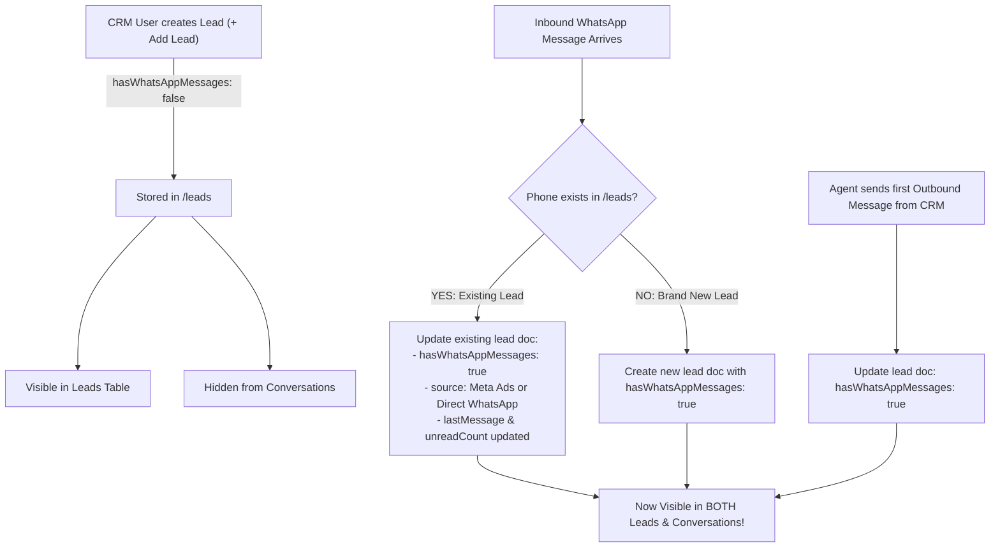

# Backend Guide: CRM Leads & WhatsApp Conversation Synchronization

## 🎯 Overview & Business Logic
1. **Manual Lead Creation from CRM**:
   - When a user creates a lead from the CRM (e.g. source: Website, Call, Referral, Walk-in, etc.), the lead document is stored in `/leads/{leadId}` with `hasWhatsAppMessages: false`.
   - **Visibility**:
     - **Leads Table (`/leads`)**: **Visible** immediately.
     - **Conversations / Chat Inbox (`/conversations`)**: **Hidden** (not shown until a WhatsApp message is sent or received).

2. **Incoming WhatsApp Message on that Number (Inbound Webhook)**:
   - When a customer sends a WhatsApp message from a phone number already registered in CRM:
     - **Do NOT create a duplicate lead document**.
     - Find the existing lead document matching the phone number.
     - Set **`hasWhatsAppMessages: true`**.
     - Dynamically update the lead's **`source`** and **`platform`**:
       - If the incoming message contains Meta Ads referral data (`message.referral` with ad ID / headline) ➔ Update `source: 'Meta Ads'`, `platform: 'Meta Ads'`, and store `referral`.
       - If it is a normal inbound message ➔ Update `source: 'Direct WhatsApp'`, `platform: 'Direct WhatsApp'`.
     - Append the message to `/leads/{leadId}/messages`.
     - Update `lastMessage`, `lastMessageText`, `lastMessageAt`, and increment `unreadCount`.
     - **Result**: The lead immediately appears inside **Conversations** with its updated WhatsApp source!

3. **Outgoing WhatsApp Message from CRM**:
   - When an agent initiates an outbound WhatsApp message to the lead from CRM:
     - Set `hasWhatsAppMessages: true` on `/leads/{leadId}`.
     - Update `lastMessage`, `lastMessageText`, and `lastMessageAt`.
     - **Result**: The lead immediately appears in **Conversations**.

---

## 🛠️ Implementation Guide for Backend / Cloud Functions

### 1. Inbound WhatsApp Webhook (`functions/index.js`)

```javascript
const functions = require('firebase-functions');
const admin = require('firebase-admin');
if (!admin.apps.length) admin.initializeApp();
const db = admin.firestore();

/**
 * Utility: Normalize phone number to pure digits or E.164 without spaces/dashes
 * e.g., "+91 78976-28204" -> "917897628204"
 */
function normalizePhone(phone) {
  if (!phone) return '';
  return String(phone).replace(/\D/g, '');
}

/**
 * WhatsApp Inbound Webhook Handler
 */
exports.whatsappWebhook = functions.https.onRequest(async (req, res) => {
  if (req.method === 'GET') {
    // Webhook verification handshake
    const mode = req.query['hub.mode'];
    const token = req.query['hub.verify_token'];
    const challenge = req.query['hub.challenge'];
    if (mode === 'subscribe' && token === 'YOUR_VERIFY_TOKEN') {
      return res.status(200).send(challenge);
    }
    return res.sendStatus(403);
  }

  if (req.method !== 'POST') {
    return res.sendStatus(405);
  }

  try {
    const entry = req.body.entry?.[0];
    const changes = entry?.changes?.[0]?.value;
    const message = changes?.messages?.[0];
    const contact = changes?.contacts?.[0];

    if (!message) {
      return res.status(200).send('EVENT_RECEIVED');
    }

    const rawFromPhone = message.from; // e.g. "917897628204"
    const normPhone = normalizePhone(rawFromPhone);
    const customerName = contact?.profile?.name || rawFromPhone;

    // Check if incoming message originates from a Meta Ad Click
    const referral = message.referral || null;
    const isMetaAd = !!(referral && (referral.source_id || referral.headline || referral.body));
    const newSource = isMetaAd ? 'Meta Ads' : 'Direct WhatsApp';

    // Extract Message text / payload
    let msgText = '';
    let msgType = message.type || 'text';
    let mediaUrl = null;

    if (msgType === 'text') {
      msgText = message.text?.body || '';
    } else if (msgType === 'image') {
      msgText = message.image?.caption || '[Image]';
      mediaUrl = message.image?.id || null;
    } else if (msgType === 'document') {
      msgText = message.document?.filename || '[Document]';
      mediaUrl = message.document?.id || null;
    } else if (msgType === 'audio') {
      msgText = '[Voice Message]';
    } else {
      msgText = `[${msgType.toUpperCase()}]`;
    }

    // Step 1: Look up if this phone number already exists in /leads
    const leadsSnapshot = await db.collection('leads')
      .where('status', '!=', 'deleted')
      .get();

    let existingLeadDoc = null;
    for (const doc of leadsSnapshot.docs) {
      const data = doc.data();
      if (normalizePhone(data.phone) === normPhone) {
        existingLeadDoc = doc;
        break;
      }
    }

    let leadId = null;
    const nowIso = new Date().toISOString();

    if (existingLeadDoc) {
      // CASE A: Existing Lead (e.g. created previously from CRM)
      leadId = existingLeadDoc.id;
      const existingData = existingLeadDoc.data();

      // Update lead document: enable conversations view & update source if Meta Ad / Direct WhatsApp
      const updatePayload = {
        hasWhatsAppMessages: true, // Now displays in /conversations!
        source: newSource,
        platform: newSource,
        lastMessage: msgText,
        lastMessageText: msgText,
        lastMessageAt: nowIso,
        lastMessageDirection: 'incoming',
        unreadCount: admin.firestore.FieldValue.increment(1),
        updatedAt: nowIso
      };

      if (isMetaAd) {
        updatePayload.referral = referral;
      }

      // If existing name was just a phone number, update to WhatsApp profile name
      if (!existingData.name || existingData.name === existingData.phone) {
        updatePayload.name = customerName;
      }

      await db.collection('leads').doc(leadId).update(updatePayload);
    } else {
      // CASE B: New Inbound WhatsApp Lead
      const newLeadRef = db.collection('leads').doc('lead_' + Date.now());
      leadId = newLeadRef.id;

      const newLeadPayload = {
        id: leadId,
        name: customerName,
        phone: rawFromPhone,
        source: newSource,
        platform: newSource,
        status: 'new',
        assigneeId: null,
        assigneeName: 'Unassigned',
        hasWhatsAppMessages: true, // Displays in /conversations
        unreadCount: 1,
        lastMessage: msgText,
        lastMessageText: msgText,
        lastMessageAt: nowIso,
        lastMessageDirection: 'incoming',
        createdAt: nowIso,
        updatedAt: nowIso
      };

      if (isMetaAd) {
        newLeadPayload.referral = referral;
      }

      await newLeadRef.set(newLeadPayload);
    }

    // Step 2: Save the message into /leads/{leadId}/messages subcollection
    const msgId = message.id || ('msg_' + Date.now());
    await db.collection('leads').doc(leadId).collection('messages').doc(msgId).set({
      id: msgId,
      text: msgText,
      type: msgType,
      mediaUrl: mediaUrl,
      direction: 'incoming',
      timestamp: message.timestamp || String(Math.floor(Date.now() / 1000)),
      createdAt: nowIso,
      status: 'received'
    });

    return res.status(200).send('EVENT_PROCESSED');
  } catch (err) {
    console.error('Error processing WhatsApp inbound message:', err);
    return res.status(500).send(err.message);
  }
});
```

---

### 2. Outbound Message Handler (`sendWhatsAppMessage`)
When an agent sends a message from CRM, ensure the lead doc updates:

```javascript
exports.sendWhatsAppMessage = functions.https.onCall(async (data, context) => {
  const { leadId, text, mediaUrl, filename, type } = data;
  
  // 1. Send via WhatsApp Cloud API
  // ...

  // 2. Update Lead document in Firestore
  const nowIso = new Date().toISOString();
  await db.collection('leads').doc(leadId).update({
    hasWhatsAppMessages: true, // Ensures it appears in /conversations
    lastMessage: text || `[${type || 'Media'}]`,
    lastMessageText: text || `[${type || 'Media'}]`,
    lastMessageAt: nowIso,
    lastMessageDirection: 'outgoing',
    hasAdminReplied: true,
    updatedAt: nowIso
  });

  return { success: true };
});
```

---

## 📊 Summary of Lead Lifecycle:


